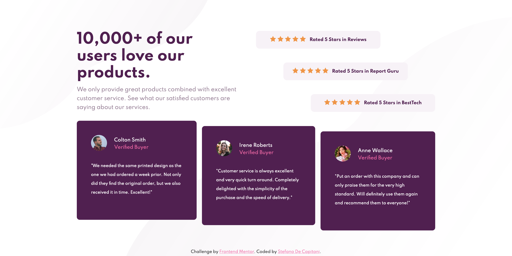

# Frontend Mentor - Social proof section solution

This is a solution to the [Social proof section challenge on Frontend Mentor](https://www.frontendmentor.io/challenges/social-proof-section-6e0qTv_bA). Frontend Mentor challenges help you improve your coding skills by building realistic projects.

## Table of contents

- [Overview](#overview)
  - [The challenge](#the-challenge)
  - [Screenshot](#screenshot)
  - [Links](#links)
- [My process](#my-process)
  - [Built with](#built-with)
  - [What I learned](#what-i-learned)
  - [Continued development](#continued-development)
- [Author](#author)

## Overview

### The challenge

Users should be able to:

- View the optimal layout for the section depending on their device's screen size

### Screenshot

### Links

- Solution URL: [https://github.com/StefanoDeCapitani/social-proof-section](https://github.com/StefanoDeCapitani/social-proof-section)
- Live Site URL: [https://stefanodecapitani.github.io/social-proof-section/](https://stefanodecapitani.github.io/social-proof-section/)

## My process

### Built with

- Semantic HTML5 markup
- CSS custom properties
- Flexbox
- CSS Grid

### What I learned

I learned that in order to resize properly the height of the body it's better to use "min-height: 100vh". Don't know if it is the best solution but at least this way I can make the body to have the same height of the page either on desktop screens and phone screens.

### Continued development

I'm looking forward to refine my knowledge about responsiveness. I don't master properly the usage of properties like max-width or media queries.
I would like to begin exploring also media queries on components.

## Author

- Frontend Mentor - [@StefanoDeCapitani](https://www.frontendmentor.io/profile/StefanoDeCapitani)
